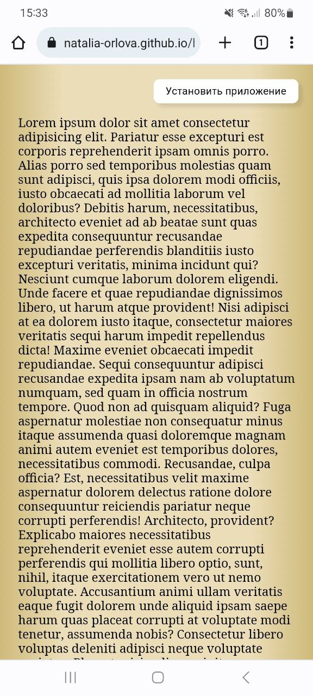

# PWA Application

1. Создан файл manifest.json, который содержит описание приложения (имя, описание, иконки и т.д.)
    В тег <head> добавлено: <link rel="manifest" href="manifest.json">

2. Создан файл service-worker.js, который обрабатывает запросы к приложению и кэширует ресурсы. В скрипте регистрируем service worker.

3. [Здесь генератор иконок](https://realfavicongenerator.net/), с помощью которого сделала иконки, после генерации скачиваем архив с иконками и копируем код, который нужно вставить в тег <head>

4. Добавлена логика для установки PWA. Для браузеров, которые позволяют веб-сайтам предлагать пользователю установку PWA, добавляем на страницу кнопку "Установить приложение" (Chrome, Edge, Yandex). При клике на кнопку отображается окно подтверждения установки приложения. Эта кнопка скрывается после установки приложения, либо остается видимой, если пользователь нажал "отмена" в диалоговом окне. 

    Лучше всего это работает в браузере Chrome, приложение устанавливается именно как приложение, а не как страница браузера с иконкой самого браузера, из которого эту страницу сохранили на главный экран. Кнопка "Установить" не появляется на странице, пока приложение установлено на устройстве пользователя. 
    В то время, как другие браузеры дают возможность добавлять страницу на домашний экран множество раз.

    Но если приложение уже установлено на Android через  Chrome, то в Yandex и Edge не будет появляться кнопка установки. Firefox также будет предлагать открыть страницу в этом приложении при попытке открыть ярлык на домашнем экране, установленный с помощью firefox.

5.  - Браузер Safari не поддерживает событие beforeinstallprompt
    - Firefox и Safari поддерживают PWA только на Android и iOS, а не на настольных компьютерах.

    Для нескольких браузеров (Safari, Firefox, Opera) добавлена кнопка "Как установить приложение?", при клике на которую в модальном окне открывается инструкция для того браузера из списка, через который пользователь зашел на сайт. При закрытии окна с инструкцией, кнопка также скрывается, но при обновлении страницы кнопка будет отображаться снова.
    
    Для того, чтобы выяснить, с какого браузера зашел пользователь, установлена библиотека ["Bowser"](https://github.com/bowser-js/bowser/tree/master/src). 

## Примеры установки приложения с помощью разных браузеров

### Установка приложения через Chrome

### Установка приложения через Firefox

*В Opera установка примерно похожа на Firefox, отличается инструкция*

